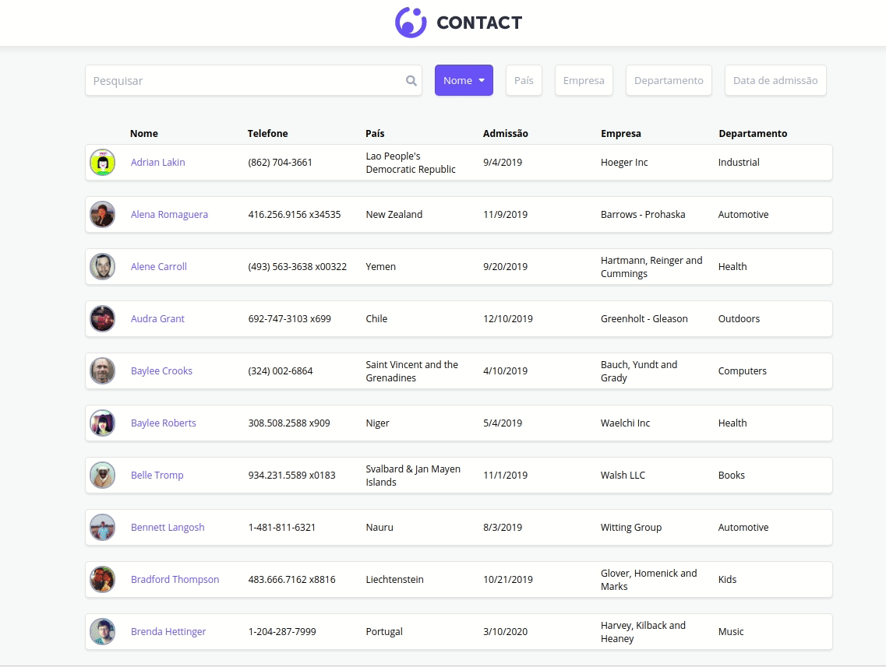

# SPA: App de Contatos

#### Acesse o [preview](https://leovictorcvo-codenation-contatos.now.sh/)

## Objetivo:

O desafio é desenvolver um _SPA (Single Page Application)_ de uma lista de contatos em **React** com as seguintes funcionalidades:

- Consumir os dados de contato através de uma API Rest, usando a _Fetch API_ do Javascript.
- Busca de um contato aplicando filtro em **tempo real**.
- Aplicar filtros de ordenação por _Nome_, _País_, _Empresa_, _Departamento_ e _Data de Admissão_.

## Iniciar o projeto:

- Instale as dependências do projeto com o comando _yarn install_ ou _npm install_.
- Inicie o projeto com comando _yarn start_ ou _npm start_ / _npm run start_.

## Requisitos:

- **[Node v13.8.0](https://nodejs.org/en/)** - ou superior, instalado em seu computador.
- **[Create React App](https://github.com/facebook/create-react-app)**

## Preview

