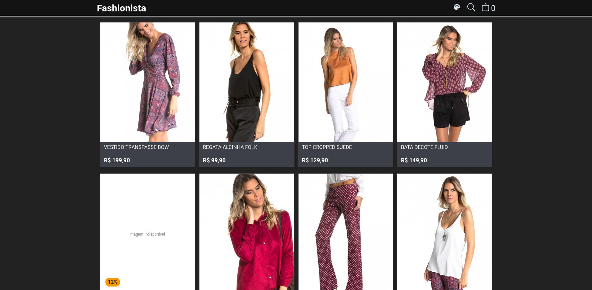

<h1 align="center">
  Fashionista
</h1>

Projeto prático desenvolvido no AceleraDev React da [Codenation](https://codenation.dev/)

  

## Objetivo

Desenvolver as principais funcionalidades de um e-commerce de moda feminina (exibir a lista de produtos, permitir a visualização detalhada do produto selecionado e os tamanhos disponíveis e gerenciar o carrinho de compras), garantindo a melhor experiência possível para os usuários interagirem com os produtos.

## Regras

- Deve ser mobile first, possuindo uma experiência satisfatória tanto em mobile quanto em desktop.
- Deve consumir a [API](https://5e9935925eabe7001681c856.mockapi.io/api/v1/catalog) do catálogo de produtos.
- O estado global da aplicação deverá ser gerenciado com Redux
- Deve ser um SPA (Single Page Application).
- Todos os produtos da API devem ser exibidos.
- Utilize BEM CSS para escrever os estilos.
- Deve-se fazer deploy do projeto, servindo-o no Netlify.
- Não utilize frameworks CSS como Bootstrap, Foundation e afins.

## Projeto publicado

Esse projeto encontrasse publicado no Netlify. Você pode acessá-lo pelo endereço: [https://fashionista-leovictorcvo.netlify.app/](https://fashionista-leovictorcvo.netlify.app/)

## Desenvolvimento

Esse projeto foi desenvolvido utilizando o React.js. Para a organização e padronização do código, utilizei o ESLint e o Prettier. A estilização, conforme solicitado, foi realizada segundo os padrões de nomenclatura estabelecidos pelo BEM CSS. A navegação entre as páginas foi feita utilizando o React Router DOM. O estado global foi gerenciado com o React Redux.

### Tecnologias

- **[React.js](https://reactjs.org/)**
- _[React Router DOM](https://reacttraining.com/react-router/web/guides/quick-start)_
- _[React Redux](https://react-redux.js.org/)_
- _[BEM CSS](http://getbem.com/)_
- _[React Icons](https://react-icons.netlify.com/#/)_
- _[ESLint](https://eslint.org/)_
- _[Prettier](https://prettier.io/)_

## Utilizando o projeto

- Clone o projeto: `git clone https://github.com/leovictorcvo/codenation.git`
- Mude para a pasta fashionista: `cd fashionista`
- Atualize as dependências: `yarn`
- Inicie o projeto: `yarn start`

Com isso vai abrir uma página no navegador com o endereço http://localhost:3000
